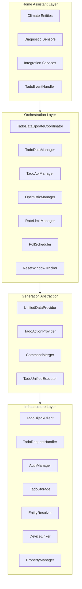

# Multi-Generation Architecture

Tado Hijack is built on a modular, generation-aware architecture. It abstracts the significant differences between Tado's classic V3 hardware and the newer Tado X generation (Hops API) into a unified data model. All statements are verified against the code in `custom_components/tado_hijack/`.

---

## 🏗️ Architectural Layers

---

## 🎛️ Orchestration Layer

### `TadoDataUpdateCoordinator`

`coordinator.py` — the central `DataUpdateCoordinator`. Inherits `OffsetCalSchedulerMixin` (offset calibration scheduling) and orchestrates every component:

- Owns all managers (`data`, `api`, `optimistic`, `rate_limit`, `reset_tracker`, `auth`, `property`).
- Reads config from the config entry (throttle threshold, debounce time, disable-polling-when-throttled, auto quota percent, safety reserve).
- Runs the poll cycle (`_async_update_data`): fetch, metadata refresh, bridges, token check, optimistic cleanup, quota sync, cost accounting, reset detection, interval adjustment.
- Calculates the next polling interval via `_calculate_auto_quota_interval()` with the priority chain documented in `docs/DESIGN.md`.
- Builds AC overlay payloads (fan speed, axis swing with single-toggle fallback) via capability-driven helpers.

### `TadoDataManager`

`helpers/data_manager.py` — "Handles fast/slow polling tracks and metadata caching."

- Multi-track polling: zones (fast), presence (default 12 h), slow hardware metadata (default 24 h), capabilities, offset, timetable/schedule tracks.
- Each unit of work is a `PollTask(cost, coroutine)` — costs feed quota accounting and `estimate_daily_reserved_cost()`.
- Tracks allow-lists for selective refresh (targeted polls), plus cache invalidation via timestamp flags.
- Produces `UnifiedTadoData` through the injected `UnifiedDataProvider` (V3 or X mapper).

### `TadoApiManager`

`helpers/api_manager.py` — "Handles queuing, debouncing and sequential execution of API commands."

- Key-based `_action_queue` with per-key debounce timers (`DEFAULT_DEBOUNCE_TIME = 5` s; re-queuing a key replaces the pending command, latest intent wins). `flow_temp` is the exception: max flow temperature and auto adaptation share one key and are merged field by field, so the second edit does not drop the first. Rollback keeps the first server value per field.
- Sequential background worker task; optional `BATCH_LINGER_S` batch flushing and call jitter for proxy usage.
- Field-level protection while commands are pending (`zone_*` → `overlay`/`overlay_active`/`setting`; `presence` → `presence`/`presence_locked`; `flow_temp` → `max_flow_temperature`/`flow_auto_adaptation`).

### `OptimisticManager`

`helpers/optimistic_manager.py` — "Manages temporary optimistic states for immediate UI feedback."

- Scoped store `{home, zone, device}`, each entry a `(value, timestamp, grace_period)` triple; default grace 30 s (`OPTIMISTIC_GRACE_PERIOD_S`).
- Cleaned up by the coordinator after every successful poll.

### `RateLimitManager`

`helpers/rate_limit_manager.py` — "Manages API quota tracking and throttling logic."

- Aggregates multiple header sources (classic v2 + Hops handlers), syncing from the most recently updated one.
- Throttles below the configured threshold (default 20 calls), reports `api_status` (`connected`/`throttled`/`rate_limited`), EMA-smooths the measured poll cost.

### `PollScheduler`

`helpers/poll_scheduler.py` — "Manages deferred poll timers for the coordinator." Owns three independent timer concerns; the adaptive interval calculation itself lives in the coordinator + `helpers/quota_math.py`:

- **expiry_poll:** one-shot poll (plus buffer) fired when an overlay timer expires — multiple may be active simultaneously.
- **queued_refresh:** debounced single-shot refresh after a resume/off action.
- **reset_poll:** one-shot poll at the daily quota reset, rescheduled by its callback.

### `ResetWindowTracker`

`helpers/reset_window_tracker.py` — "Tracks quota reset patterns and learns the actual reset window."

- Observes reset events; a learned window is confirmed only after 2 consecutive resets at the same hour (history: 5 events, stored in UTC so DST never shifts the learned hour). Single resets or pattern breaks do not touch the confirmed window (outlier protection).
- Until a pattern is confirmed, the default hour (`API_RESET_DEFAULT_UTC_HOUR = 11` UTC) is used.
- The learned/default expected hour feeds `quota_math` budget distribution and the ±1 h reset safe window.

### `PropertyManager`

`helpers/property_manager.py` — "Handles generic zone and device property updates with optimistic state."

- `async_set_zone_property()` / `async_set_device_property()`: apply the optimistic write, notify listeners, queue the command (key `f"{cmd_type.value}_{zone_id}"` or `f"{cmd_type.value}_{serial_no}"`) with its `rollback_context`.

### `AuthManager`

`helpers/auth_manager.py` — handles credential management and token refresh for the Tado cloud API session; the coordinator calls `check_and_update_token()` every cycle.

### `TadoStorage`

`helpers/storage.py` — persistent key/value storage for the integration (reset history, calibration state).

### `WindowController`

`helpers/window_controller.py` — links an external contact `binary_sensor` per zone. Open turns the zone off, close resumes the schedule. Cloud calls go through the command queue. With the resume hold on, the linked climate is set at once and the cloud resume waits (see the README). `timeout` also resumes when the zone's open-window timer expires while the sensor is still open. Already-open windows are applied once at startup.

### Local recovery

Offline HomeKit and Matter TRVs do not see a cloud write. Three pieces remember the last intent and replay it when the local climate entity is reachable again:

- `AvailabilityTracker` maps each TRV serial to its local climate entity, seeds availability from the current state, and refreshes the map when climate entities appear later.
- `LocalRecoveryQueue` stores one last-wins intent per unavailable serial. An expiry (open-window timeout or overlay duration) means recovery resumes the schedule instead of replaying a stale overlay.
- `LocalRecoveryListener` batches serials that return together and replays temperature or off on the local climate entity. Resume-schedule is cloud-only and is resent only when `recovery_cloud_replay` is on.

`trv_serials()` in `helpers/zone_utils.py` is the shared serial lookup for the tracker and the queue.

### `OffsetCalSchedulerMixin`

`helpers/offset_cal_config.py` — bridge default plus per-zone interval and threshold (`inherit`, or threshold `0`, clears the override). Clock modes share one timer. `threshold` watches the linked sensor instead. Calibration polls an offset only when none is known. User-facing rules are in `docs/FEATURES.md`.

---

## 🔄 Generation Abstraction

Tado Hijack uses a polymorphic design to handle the shift from the legacy Classic API to the new Hops API used by Tado X.

### Data Fetching: `UnifiedDataProvider`

A `typing.Protocol` (`helpers/models_unified.py`) ensuring the integration receives data in a standardized format regardless of API structure:

- **`TadoV3Mapper`** (`helpers/tadov3/mapper.py`) — parses Classic API responses (temperatures in `.celsius`).
- **`TadoXMapper`** (`helpers/tadox/mapper.py`) — parses Hops API responses (temperatures in `.value`), mapping the device-centric X model onto zone-centric state.

Because both conform to the same protocol, downstream code uses duck typing with `getattr()` fallbacks rather than generation checks wherever possible.

### Command Execution: `TadoActionProvider`

Abstract base class (`helpers/action_provider_base.py`) abstracting write operations:

- **`TadoV3Executor`** (`helpers/tadov3/executor.py`) — bulk overlay via `POST /homes/{id}/overlay` for Classic devices (heating, AC, hot water in one call).
- **`TadoXExecutor`** (`helpers/tadox/executor.py`) — Hops endpoints via the `TadoXApi` bridge: house-wide `quickActions/*`, per-room `manualControl` (Hops has no mixed-room overlay body), hot water via `programmer/domesticHotWater/*`.

`TadoUnifiedExecutor` routes each merged batch to the generation-specific executor; the `CommandMerger` fuses queued commands first (see `docs/DESIGN.md` for the full pipeline).

---

## 🔗 Device Unification & Resolution

### `EntityResolver` & `DeviceLinker`
Two complementary utilities bridging Tado's cloud and Home Assistant's local registry:

**`EntityResolver`** (`helpers/entity_resolver.py`) resolves HA entity IDs to Tado zone IDs — caching lookups, parsing unique IDs, and performing deep registry scans, including resolving device entities (e.g. `child_lock_VA123`) back to their owning zone via serial number.

**`DeviceLinker`** (`helpers/device_linker.py`) handles device unification. It builds a cache from the HA device registry keyed by `serial_number`, matching Tado devices regardless of platform (HomeKit or Matter). When a cloud serial matches a local device, cloud and local entities are linked so X-generation devices (not exposed as classic zones) map onto a single HA device.

---

## 🔌 API Bridge Layer

### `TadoHijackClient` / `TadoXApi`

`lib/` contains the API bridges: `TadoHijackClient` wraps the pinned `tadoasync` library with the runtime patches from `patches.py` (see `docs/COMPATIBILITY.md`), while `lib/tadox_api.py` implements the entire Hops surface on top of the authenticated session (Tado X is not supported by tadoasync at all).

### `TadoRequestHandler`

`helpers/tado_request_handler.py` — hijacks tadoasync's internal request logic for every classic/Energy-IQ call: browser-mimicry headers, transparent proxy routing, rate-limit header capture (feeding both `RateLimitManager` sources), timeout and 204 handling. No retry/backoff loop — quota is conserved through batching and adaptive polling instead.

---

## 🌐 Cross-Cutting Concerns

- **Redaction:** all modules log through `get_redacted_logger()` (`helpers/logging_utils.py`) with regex-based scrubbing of emails, tokens and serial numbers.
- **Physics:** `helpers/climate_physics.py` provides pure Magnus-formula functions (dew point, absolute humidity, mold risk, ventilation benefit) shared by both generations' parsers.
- **Diagnostics:** `diagnostics.py` exposes quota state, thresholds and learned reset windows for HA's diagnostics download.
