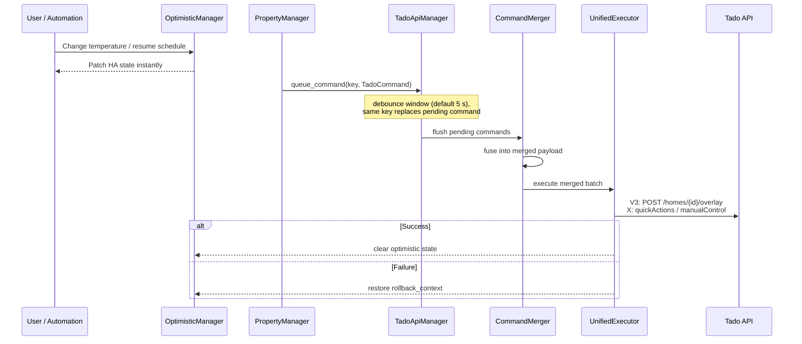
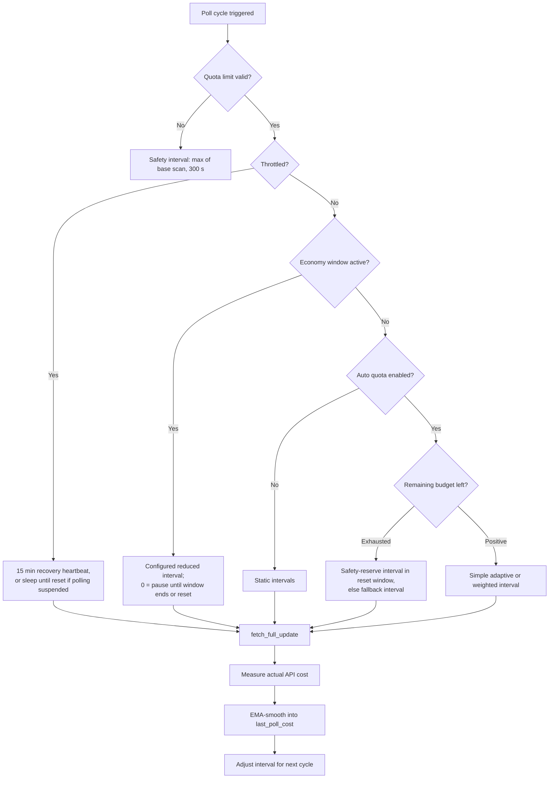

# System Design & Pipelines

Tado Hijack is engineered for maximum responsiveness and extreme quota efficiency. This document describes the internal pipelines — how a command travels from a UI click to the Tado API, how polling adapts to the daily quota, and how state integrity is protected. All statements are verified against the code in `custom_components/tado_hijack/`.

---

## ⚡ Command Execution Pipeline

All state-changing actions follow a non-blocking, asynchronous pipeline: optimistic UI feedback first, then key-based deduplication with debouncing, command fusion, and generation-specific bulk execution.



### 1. Instant Feedback (`OptimisticManager`)

`helpers/optimistic_manager.py` — patches Home Assistant's internal state the moment a command is issued, so sliders and buttons react instantly even while the API call is still queued.

- **Scoped store:** `{"home", "zone", "device"}` — every entry is a `(value, timestamp, grace_period)` triple keyed by entity/zone/serial.
- **Grace period:** 30 s default (`OPTIMISTIC_GRACE_PERIOD_S`); custom per-operation grace possible via `set_optimistic(..., grace_period=...)`.
- **Expiry:** the coordinator calls `optimistic.cleanup()` after every successful poll cycle — stale optimistic values are dropped.
- **Rollback:** every command carries a `rollback_context` (captured before the optimistic write); on API failure the executor restores it.

### 2. Queuing & Deduplication (`TadoApiManager`)

`helpers/api_manager.py` — handles queuing, debouncing and sequential execution of API commands.

- Commands enter an `_action_queue` dict under a string **key**. Queueing a key that is already pending cancels its debounce timer and replaces the command — the latest intent wins. When redundant-call suppression is enabled, a replaced command carries the original rollback state over (`helpers/redundancy_checker.preserve_rollback_state`), so the redundancy filter always compares against the last confirmed server state, not an optimistic intermediate value.
- **Keys** are built by the `PropertyManager` as `f"{cmd_type.value}_{zone_id}"` (zone properties) or `f"{cmd_type.value}_{serial_no}"` (device properties); well-known singleton keys are `presence`, `flow_temp` and manual-poll keys.
- **Debounce window:** default 5 s (`DEFAULT_DEBOUNCE_TIME`, user-configurable, minimum 1 s). Every freshly queued command re-arms the debounce for **all** pending keys, so a busy user keeps extending the window for the whole batch.
- A sequential background worker task drains the queue; batches linger briefly (`BATCH_LINGER_S`) to catch trailing intents. Optional call jitter (`CONF_CALL_JITTER_ENABLED`, `CONF_JITTER_PERCENT`) is strictly proxy-gated: it only applies when `CONF_API_PROXY_URL` is configured, randomizing a short base delay around each API call.

### 3. Command Fusion (`CommandMerger`)

`helpers/command_merger.py` — the core of quota conservation.

- Collects every command flushed after a debounce window and fuses them into a single merged payload for the executor.
- Internal control fields are stripped before execution: `_MERGED_CONTROL_KEYS` = `old_presence`, `old_locked`, `manual_poll`, `capability_zone_ids`, `targeted_polls`, `capabilities_all` — plus anything starting with `rollback_` (exposed via `executor_payload()`). `merged_has_executor_work()` skips batches that turn out to be empty.
- **Effect:** turning off 10 rooms costs **1 API call** on Classic (`POST /homes/{id}/overlay`) instead of 10.

### 4. Unified Execution (`TadoUnifiedExecutor` / `TadoActionProvider`)

Routes each merged batch to the generation-specific executor:

- **V3 Executor:** bulk overlay via the classic API — heating, AC and hot water zones fused into one call.
- **X Executor (Hops):** house-wide `quickActions/*` (boost / off / resume); per-room `manualControl` for mixed-room sets, since Hops has no mixed-room overlay body.

On failure the executor restores the `rollback_context` through the optimistic manager — no ghost states.

---

## 📊 Polling & Quota Management

The coordinator fetches data in cycles and adapts its own interval after every fetch, based on quota telemetry, learned reset windows and configuration.



### Fetch Cycle (`coordinator._async_update_data`)

Verified sequence per poll:

1. Record `quota_start` = current remaining quota.
2. If throttled and `CONF_DISABLE_POLLING_WHEN_THROTTLED` is set, serve cached data (a first fetch is still allowed if no data exists yet).
3. `data_manager.fetch_full_update()` — multi-track polling (zones/presence/slow metadata/capabilities),
4. Refresh zone/device metadata, bridges (`discovery.get_bridges`), climate map.
5. `auth_manager.check_and_update_token()` and `optimistic.cleanup()`.
6. `rate_limit.sync_from_headers()` — adopt the newest header telemetry.
7. Cost accounting: `actual_cost = quota_start − remaining`, minus capabilities-refresh calls; the remainder updates `rate_limit.last_poll_cost` (EMA) and `_polling_calls_today`.
8. `_detect_quota_reset()` — on a detected reset, `_maybe_calibrate_offsets_on_reset()` may trigger offset calibration.
9. Attach `RateLimit` and `api_status` to the fetched data, then `_adjust_interval_for_auto_quota()`.

Transient errors (`TimeoutError`, `TadoError`, `aiohttp.ClientError`) serve cached data; `UpdateFailed` is raised only if no data exists yet.

### Interval Decision Priority (`_calculate_auto_quota_interval`)

1. **Invalid limit** (≤ 0) → safety interval (`max(base_scan_interval, 300)`).
2. **Throttled** → 15-minute recovery heartbeat (`THROTTLE_RECOVERY_INTERVAL_S = 900`); with polling-suspend enabled, `max(900, seconds_until_reset)` — asleep until the next reset, at least 15 min.
3. **Economy window active** → configured reduced interval; `0` computes a sleep span by scanning ahead in 15-minute steps, bounded by the next reset and the minimum interval.
4. **Auto quota disabled** → no adaptive scheduling.
5. **Budget exhausted** → if inside the reset safe window with a safety reserve > 0, distribute the reserve over the 3-hour window; otherwise fall back to the base scan interval.
6. **Normal operation** → simple adaptive interval, or `calculate_weighted_interval()` when a reduced window is configured.

### Poll Cost Measurement (EMA Smoothing)

The measured cost of each successful cycle is smoothed with an exponential moving average to avoid jitter:

```python
# rate_limit_manager.py (setter for last_poll_cost)
alpha = RATELIMIT_SMOOTHING_ALPHA
self._last_poll_cost = (self._last_poll_cost * (1 - alpha)) + (value * alpha)
```

The getter floors the cost at 1.0. Future budget planning uses `data_manager._measure_zones_poll_cost()` as the per-cycle prediction, and `estimate_daily_reserved_cost()` for reserved background spend (hardware sync, presence, capabilities, offset calibration) over 24 h.

### Budget Math (`helpers/quota_math.py`)

- `check_quota_reset()`: any **increase** in remaining quota signals a reset (quota can only decrease otherwise); a min-percent guard filters throttled `0 → 1` edge cases.
- `calculate_remaining_polling_budget()`: daily budget = (limit − background_cost_24h − throttle_threshold), scaled by the configured auto-quota percent. **External-usage inference:** quota consumed today beyond the reserved background spend is treated as external usage (e.g. the official app); if it exceeds the throttle threshold, the effective threshold is raised accordingly so extra consumers eat into the polling budget. The planned budget (daily budget minus polls already made today, with progress-prorated background consumption deducted) is capped by the currently available headroom (remaining − effective threshold − future background spend), then the safety reserve is subtracted.
- `calculate_safety_reserve_interval()`: the reset safe window spans ±1 h around the expected hour (3 h total); the reserve is distributed evenly — e.g. 2 reserved calls → `10800 // 2 = 5400 s` interval; a zero reserve falls back to one hour (`SECONDS_PER_HOUR`).
- `is_in_reset_safe_window()`: ±1 h tolerance around the expected UTC hour, wrapping at the day boundary.

### Reset Window Learning (`ResetWindowTracker`)

- Reset timestamps are normalized to **UTC** so DST transitions never shift the learned hour; display converts to Berlin local time.
- A learned window is confirmed only after `API_RESET_PATTERN_THRESHOLD = 2` **consecutive** resets at the same hour (history keeps the last `API_RESET_HISTORY_SIZE = 5` events).
- Until a pattern is confirmed, the default hour `API_RESET_DEFAULT_UTC_HOUR = 11` (UTC, ≈ 12:00/13:00 Berlin, DST-dependent) with midpoint minute 30 is used.
- Confidence is reported as `learned` or `default`.

### Economy Window (Reduced Polling)

Configured via `reduced_polling_start` / `reduced_polling_end` / `reduced_polling_interval`. During the window the configured interval replaces the adaptive calculation; setting the interval to `0` pauses updates entirely until the window ends or the next reset.

---

## 🛡️ State Integrity & Safety

### Field Locking & Race-Condition Prevention

While a command is pending, the fields it affects are locked — stale poll data cannot overwrite the user's intent until the server confirms it. Protected fields per command key (`TadoApiManager`):

| Command key | Protected fields |
|---|---|
| `zone_*` (overlay/resume/cancel) | `overlay`, `overlay_active`, `setting` |
| `presence` | `presence`, `presence_locked` |
| `flow_temp` | `max_flow_temperature`, `flow_auto_adaptation` |
| device keys (e.g. offsets) | none (device-level only) |

The `PropertyManager` (`helpers/property_manager.py`) drives this pattern via `async_set_zone_property()` / `async_set_device_property()`: apply the optimistic write, notify listeners (`async_update_listeners()`), then queue the command with its `rollback_context`.

Replacing a pending `flow_temp` command merges the payload instead of dropping the other field. The rollback context keeps the first captured server value for each field. The executor reads `autoAdaptation.enabled`; it does not coerce the dict itself with `bool()`.

### Local TRV recovery

Cloud writes always go out. `AvailabilityTracker` follows the local climate entity for each TRV serial (HomeKit or Matter). It reads the current state when the entity is first mapped, so a device that is already `unavailable` at startup is queued, and it rebuilds the map when climate entities show up later.

`LocalRecoveryQueue.capture_overlay` / `capture_resume` record the latest intent only for serials that are unavailable. On recovery, a still-valid overlay is applied with `climate.set_temperature` or `climate.set_hvac_mode`. An intent whose `expires_at` has passed, or an explicit resume, is a schedule resume. Those are resent to the cloud only when `recovery_cloud_replay` is enabled, one call per zone. Serials that return within `RECOVERY_BATCH_DEBOUNCE_S` (0.2 s) share that batch. A router that brings devices back over several seconds produces more than one batch; each batch is still correct.

Tado X hot water calls the same capture helpers after a successful programmer call. The virtual zone has no TRV serials, so nothing is stored unless a local device is mapped to that zone. A failed programmer call does not capture.

### Throttling (`RateLimitManager`)

- Watches **multiple header sources** (classic v2 handler and the Hops handler both count) and syncs from whichever was updated last (`updated_at` timestamp).
- `is_throttled` when remaining < throttle threshold (default `DEFAULT_THROTTLE_THRESHOLD = 20`); `api_status` is `connected`, `throttled` or `rate_limited`.
- An initial guess seeds the counter before the first headers arrive; local actions decrement it, and `sync_from_headers()` adopts real telemetry.

---

## 🌡️ Indoor Climate Physics

`helpers/climate_physics.py` — pure functions (no HA state access), shared by the Classic (v3) and Tado X parsers. Temperature in °C, relative humidity in %.

- **Dew point** — Magnus formula (Bolton 1980, valid −30…+35 °C, error < 0.1 % over water) with a = 17.67, b = 243.5:

```python
gamma = (17.67 * temp) / (243.5 + temp) + math.log(rh / 100.0)
dew_point = (243.5 * gamma) / (17.67 - gamma)
```

- **Absolute humidity** (g/m³) — Magnus saturation vapour pressure es(T) = 6.112 · exp(a·T/(b+T)) hPa, converted with factor 216.7 and absolute temperature.
- **Mold risk** — 4-step rating from the spread `T_room − Td` (margin between room air and dew point; cold surfaces sit closer to the dew point):

| Spread | Level | Meaning |
|---|---|---|
| > 7 °C | `none` | surface RH well below 70 % |
| > 5 °C | `low` | cold bridges / poorly insulated spots |
| > 3 °C | `medium` | corners, airing recommended |
| ≤ 3 °C | `high` | near-condensation, widespread risk |

- **Ventilation recommendation** — `True` when indoor absolute humidity exceeds outdoor absolute humidity by at least the threshold (default `1.0 g/m³`), preventing automation chatter from negligible differences. Requires an outdoor weather entity for comparison.

---

## 🔧 Key Constants (Defaults)

| Constant | Value | Meaning |
|---|---|---|
| `DEFAULT_DEBOUNCE_TIME` | 5 s | command debounce window (min 1 s) |
| `OPTIMISTIC_GRACE_PERIOD_S` | 30 s | optimistic state grace |
| `DEFAULT_THROTTLE_THRESHOLD` | 20 | remaining calls reserved for external use |
| `THROTTLE_RECOVERY_INTERVAL_S` | 900 s | 15-minute throttle heartbeat |
| `DEFAULT_QUOTA_SAFETY_RESERVE` | 2 | calls reserved for the reset window |
| `DEFAULT_MIN_AUTO_QUOTA_INTERVAL_S` | 20 s | fastest adaptive polling |
| `API_RESET_PATTERN_THRESHOLD` | 2 | consecutive same-hour resets to learn |
| `API_RESET_HISTORY_SIZE` | 5 | reset events kept |
| `API_RESET_DEFAULT_UTC_HOUR` | 11 | fallback reset hour (UTC) |
| `DEFAULT_PRESENCE_POLL_INTERVAL` | 43200 s | presence track (12 h) |
| `DEFAULT_SLOW_POLL_INTERVAL` | 86400 s | hardware metadata track (24 h) |
| `DEFAULT_OFFSET_POLL_INTERVAL` | 0 | offset calibration track (disabled) |
| `DEFAULT_OFFSET_CAL_SEND_COOLDOWN_S` | 300 s | threshold mode: wait after an offset write |
| `DEFAULT_OFFSET_CAL_WINDOW_SETTLE_S` | 300 s | threshold mode: wait after the window closes |
| `DEFAULT_WINDOW_RESUME_BATCH` | on | hold cloud resume after a window; local setpoint is immediate |
| `DEFAULT_WINDOW_RESUME_BATCH_S` | 120 s | how long that hold lasts (0 sends on the next pass) |
| `RECOVERY_BATCH_DEBOUNCE_S` | 0.2 s | window for grouping TRVs that recover together |
| `DEFAULT_RECOVERY_CLOUD_REPLAY` | on | resend cloud-only resume when a TRV returns |
